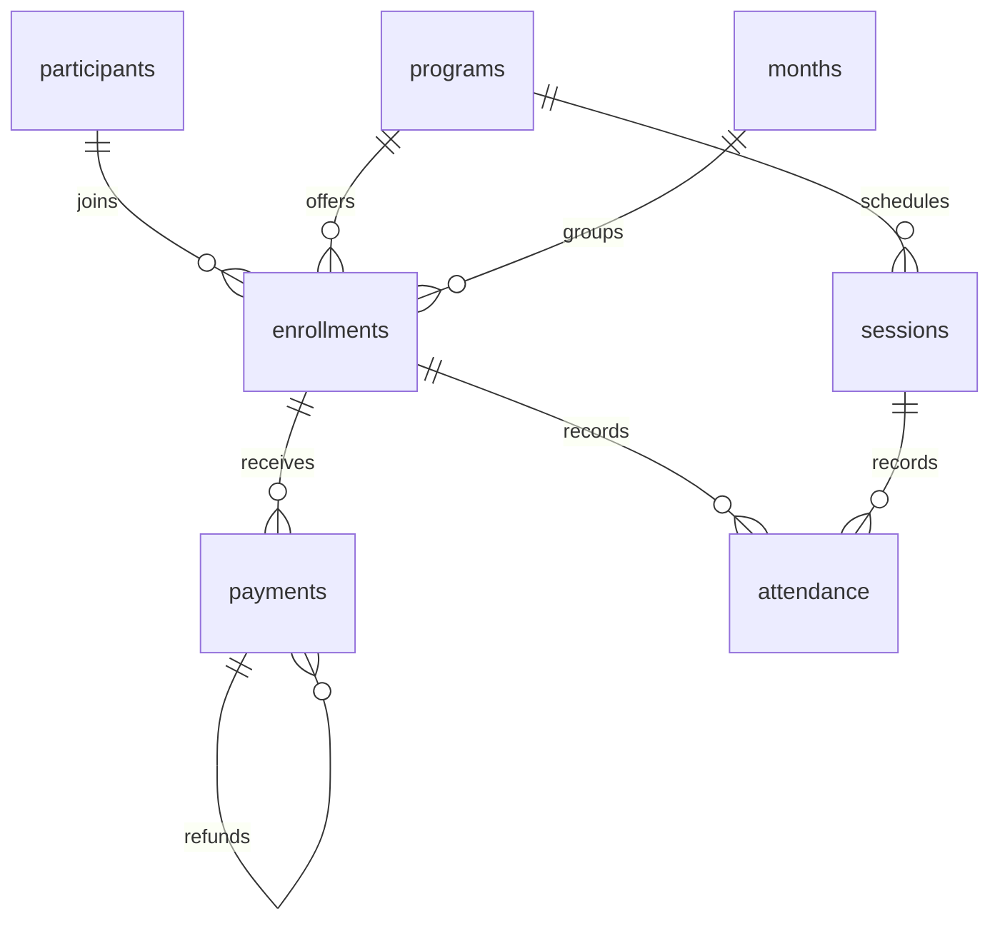

# Community Sports SQL Analytics

A SQL-first analytics project that turns enrollment, attendance, and payment records into defined, tested metrics. It models a fictional community sports organization and demonstrates relational design, CTEs, window functions, cohort analysis, and data-quality checks.

**All records are synthetic. This is an independent portfolio demonstration, not Midnimo Athletics operational data or business results.**

## Questions answered

| Question | SQL | Important decision |
| --- | --- | --- |
| How does monthly cash collection change? | [Revenue](sql/queries/monthly_revenue.sql) | Failed charges excluded; refunds reduce their transaction month; `LAG` calculates growth |
| Which programs have spare capacity? | [Capacity](sql/queries/capacity.sql) | Count at program-month grain without multiplying rows through payment/attendance joins |
| Are participants attending scheduled sessions? | [Attendance](sql/queries/attendance.sql) | Held sessions only; missing records remain in the denominator and recording coverage is separate |
| Do new participants return? | [Retention](sql/queries/retention.sql) | Deduplicate across programs; fill observed zeros; omit future periods |
| Are the inputs internally consistent? | [Quality](sql/queries/data_quality.sql) | Check program/month alignment, canceled sessions, refunds, and capacity |

## Run it

Python 3.9+ and SQLite 3.25+ are sufficient; there are **no third-party Python dependencies**. CI uses Python 3.12.

```bash
git clone https://github.com/kasimomar/community-sports-sql.git
cd community-sports-sql
python3 analyze.py
python3 -m unittest discover -s tests -v
```

`build/` contains a reusable `sports.sqlite` database and one CSV per query. Every run builds a fresh in-memory database from versioned SQL, validates it, then exports it. Re-running replaces generated outputs deterministically. Checked-in [CSV results](reports/csv) make the project inspectable without installing anything.

With the SQLite CLI installed:

```bash
sqlite3 -header -column build/sports.sqlite < sql/queries/monthly_revenue.sql
sqlite3 -header -column build/sports.sqlite < sql/queries/retention.sql
```

## Data model



- `participants`: one synthetic participant ID and code; no names or contact information.
- `enrollments`: one participant-program-month, enforced with a unique constraint.
- `payments`: one charge/refund attempt, integer cents, explicit success/failure, refunds linked to the original charge.
- `sessions`: one dated program session with held/canceled status.
- `attendance`: one enrollment-session observation; missing observations are possible.
- `months`: a calendar spine, including one future month to exercise censoring.
- `reporting_context`: a reproducible cutoff of **2026-04-30**.

## Metric definitions

**Net collection** = succeeded charges minus succeeded refunds by transaction date. This is cash movement, not accrual revenue, profit, or contracted recurring revenue. A January charge refunded in February reduces February net collection. Month-over-month growth is NULL for the first month or when prior net collection is zero.

**Capacity utilization** = enrolled participants / monthly program capacity. Each enrollment covers the entire month. Capacity is assumed constant across the fixture; production data would need effective-dated capacities, cancellations, and partial-month enrollments.

**Attendance** = present visits / eligible held-session visits. Each enrollment is eligible for all held sessions in its program/month. Missing marks count as not-present for this conservative measure; **recording coverage** shows recorded marks / eligible visits so absence is not confused with missing data. Program-months with no eligible held sessions have no attendance row; they are not reported as 0% attendance.

**Retention** = members active in the observed month / original cohort size. The cohort is the participant's first enrollment month in the available data; activity in any program counts once. A gap followed by a return counts as retained in the return month. This is monthly activity retention, not uninterrupted subscription survival. Future periods are omitted, not filled with zeros. If a partial-month cutoff is used, its results are month-to-date.

## Synthetic results

| Month | Net collection | Month-over-month |
| --- | ---: | ---: |
| January | $240 | — |
| February | $290 | 20.83% |
| March | $240 | -17.24% |
| April | $190 | -20.83% |

Total net collection is **$960**. The January cohort has five participants and retains 60%, 40%, and 0% in months 1–3. January soccer attendance is 50% with 83.33% recording coverage. These values are hand-checkable fixture expectations, not evidence about a real organization.

See [the interpretation and limitations](reports/findings.md) for how these metrics should inform follow-up questions.

## Verification and design choices

Tests cover failed payments, refund timing, zero-revenue months, zero growth denominators, duplicate enrollments, orphan records, missing attendance, canceled sessions, cross-program deduplication, future censoring, over-refunds, and deterministic exports. GitHub Actions runs the tests, regenerates outputs, and compares CSVs to the checked-in results.

The fixture is intentionally small (8 participants, 17 enrollments) so joins and denominators can be audited by hand. This repository demonstrates correctness and communication, not a large-scale warehouse benchmark. SQL lives in standalone files; Python only orchestrates database setup, validation, and export.

## Next improvements

- Add an import contract and quarantine invalid external records before analysis.
- Model enrollment cancellations, waitlists, and effective-dated program capacity.
- Port to PostgreSQL or DuckDB and compare query plans on a larger generated fixture.
- Add a dashboard after validating the SQL metric layer.

Use an issue, a focused branch, and a linked pull request for each improvement.
