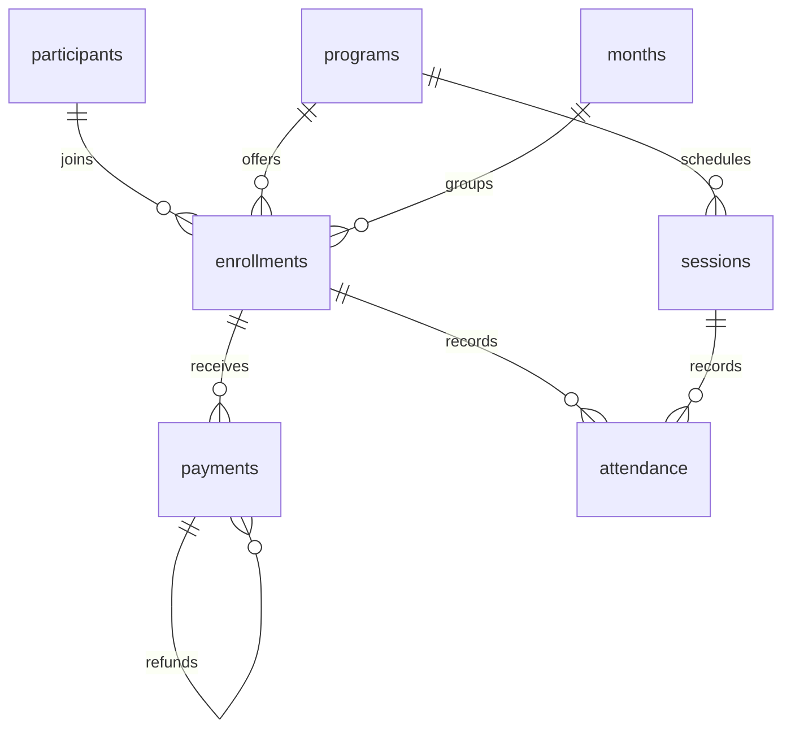

# Community sports analytics

SQL queries for a small sports program: how much money was collected, how many places are filled, whether participants attend, and whether they return.

The data is synthetic: 8 participants and 17 enrollments across two programs. It isn't Midnimo Athletics data. Keeping the fixture small makes it possible to check the joins and totals by hand.

## Run it

Python 3.9+ and SQLite 3.25+ are enough. There are no third-party Python dependencies; CI uses Python 3.12.

```bash
git clone https://github.com/kasimomar/community-sports-sql.git
cd community-sports-sql
python3 analyze.py
python3 -m unittest discover -s tests -v
```

The runner creates a fresh database, checks the data, and writes CSV reports and `sports.sqlite` to `build/`. Running it again replaces the generated outputs. The [saved CSVs](reports/csv) let you inspect the results without installing anything.

If you have the SQLite CLI:

```bash
sqlite3 -header -column build/sports.sqlite < sql/queries/monthly_revenue.sql
sqlite3 -header -column build/sports.sqlite < sql/queries/retention.sql
```

## Queries

| Query | What it answers |
| --- | --- |
| [Monthly collection](sql/queries/monthly_revenue.sql) | Successful charges minus refunds, with month-over-month growth using `LAG` |
| [Capacity](sql/queries/capacity.sql) | Enrollments, open places, and utilization by program and month |
| [Attendance](sql/queries/attendance.sql) | Attendance and recording coverage for held sessions |
| [Retention](sql/queries/retention.sql) | How many participants from each starting cohort return in later months |
| [Data checks](sql/queries/data_quality.sql) | Invalid refunds, attendance mismatches, canceled-session records, and over-capacity programs |

## Tables



An enrollment is one participant, program, and month. Payments record each charge or refund attempt, including failures. Attendance records belong to an enrollment and a session. Unique constraints and foreign keys catch duplicates and orphaned records.

The calendar includes a future month so the retention query can be checked for accidentally treating future activity as zero. `reporting_context` sets the reporting date to **April 30, 2026**.

## Definitions that affect the results

**Collection:** only successful payments count. A refund reduces the month it occurred, even if the original charge was earlier. Amounts are stored as integer cents. This measures cash movement, not profit or accrual revenue. Growth is NULL for the first month or when the previous month's net collection is zero.

**Capacity:** enrollments divided by program capacity, counted at the program-month level. Joining payment or attendance records here would multiply rows and inflate the count. The fixture assumes full-month enrollments and fixed capacity.

**Attendance:** present visits divided by eligible visits at held sessions. Missing marks stay in the denominator, so recording coverage is shown separately. Canceled sessions are excluded. A program-month with no eligible held sessions has no attendance row, rather than a reported 0%.

**Retention:** participants active in a month divided by their original cohort size. The cohort starts with their first enrollment in the available data. Activity in two programs still counts once. Returning after a gap counts as active again; this isn't continuous subscription retention. Observed months with no returns show zero, and future months are omitted. A partial-month reporting date produces month-to-date results.

## Sample results

| Month | Net collection | Change |
| --- | ---: | ---: |
| January | $240 | — |
| February | $290 | 20.83% |
| March | $240 | -17.24% |
| April | $190 | -20.83% |

Total collection is **$960**. Of the five January participants, three return in February, two in March, and none in April. January soccer attendance is 50%, with 83.33% of eligible visits actually recorded.

[Findings](reports/findings.md) explains what these numbers show and what would need checking in real data.

## Tests and next steps

The tests cover refund timing, failed charges, zero denominators, duplicate and orphan records, missing attendance, canceled sessions, participants in multiple programs, future months, and repeatable exports. CI also compares newly generated CSVs with the saved results.

Useful extensions would be enrollment cancellations, effective-dated capacity, an import process that separates invalid records, and a larger fixture for comparing query plans. A dashboard would sit on top of these metric definitions rather than redefine them.
